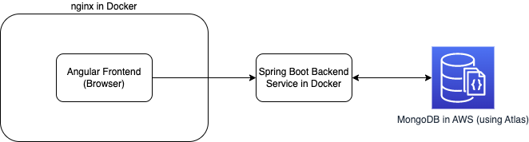

# Keeptruckin - Backend

This project is based on Spring Boot 3.x

Demo of this application can be found here: http://keeptruckin.balakumar.xyz
(Recommend to visit this demo site before going through the code)

## Running the Application
I have added the appropriate Docker configs to run and serve the application. All you need is docker, and run the following command (No need for java or jdk or maven or any dependency at all)
> docker-compose up -d

To stop the application, just do this command
> docker-compose down --rmi all

### Validate if its running
You can checkout the REST APIs exposed by this service using
> http://localhost:8080/swagger-ui.html

### REST APIs
> http://keeptruckin.balakumar.xyz:8080/swagger-ui.html

